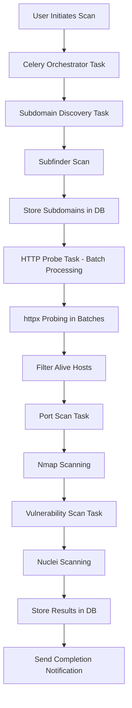

# Celery Large-Scale Attack Surface Scanning Guide

## 🎯 **Overview**

This guide demonstrates how Celery dramatically improves your Attack Surface Management application's performance when scanning large domains with hundreds or thousands of subdomains.

## 🚀 **Key Benefits for Large-Scale Scanning**

### **1. Asynchronous Processing**
- **Problem**: Large domains (like `microsoft.com` or `google.com`) can have 10,000+ subdomains
- **Solution**: Celery processes scans in background workers while dashboard remains responsive
- **Impact**: Users can continue using the application during 30+ minute scans

### **2. Horizontal Scaling**
- **Problem**: Single-threaded scanning limits throughput
- **Solution**: Multiple Celery workers handle different domains simultaneously
- **Impact**: Scale from 1 domain/hour to 10+ domains/hour with proper worker configuration

### **3. Intelligent Task Management**
- **Problem**: No queuing system for multiple scan requests
- **Solution**: Celery provides task queuing, prioritization, and retry mechanisms
- **Impact**: Handle burst scanning requests without overwhelming system resources

### **4. Real-time Progress Tracking**
- **Problem**: Users have no visibility into long-running scan progress
- **Solution**: Task status updates with detailed progress information
- **Impact**: Users see live updates as subdomains are discovered and scanned

## 🏗️ **Architecture Overview**

```
┌─────────────────┐    ┌──────────────────┐    ┌─────────────────┐
│   Flask Web     │    │   Redis Broker   │    │  Celery Workers │
│   Application   │◄──►│   (Task Queue)   │◄──►│   (Scanners)    │
└─────────────────┘    └──────────────────┘    └─────────────────┘
         │                                               │
         ▼                                               ▼
┌─────────────────┐                            ┌─────────────────┐
│   PostgreSQL    │                            │  Security Tools │
│   Database      │                            │ Subfinder/Nmap  │
└─────────────────┘                            │ Nuclei/httpx    │
                                               └─────────────────┘
```

## 📊 **Scanning Workflow for Large Domains**

### **Optimized Pipeline: Subfinder → httpx → Nmap + Nuclei**



## 🛠️ **Implementation Details**

### **1. Task Orchestrator**
The `large_domain_scan_orchestrator` task manages the complete workflow:

```python
# Example usage
from tasks import large_domain_scan_orchestrator

# Start large-scale scan
task = large_domain_scan_orchestrator.delay(
    domain='example.com',
    organization_id=1,
    scan_type='deep'
)

# Get task ID for tracking
task_id = task.id
```

### **2. Individual Scanning Tasks**

#### **Subdomain Discovery**
- Uses `subdomain_discovery_task` for Subfinder integration
- Configurable timeouts based on scan type (quick: 1min, deep: 5min, full: 10min)
- Automatic database storage of discovered subdomains

#### **HTTP Probing**
- Uses `http_probe_task` for httpx integration
- Batch processing for large subdomain lists (50-100 per batch)
- Filters alive hosts for subsequent scanning phases

#### **Port Scanning**
- Uses `port_scan_task` for Nmap integration
- Only scans alive hosts (efficiency optimization)
- Configurable port ranges based on scan intensity

#### **Vulnerability Scanning**
- Uses `vulnerability_scan_task` for Nuclei integration
- Template selection based on scan type
- Rate limiting to prevent overwhelming targets

### **3. Real-time Progress Tracking**

```python
# Check scan progress
GET /api/scan/status/{task_id}

# Response example
{
    "success": true,
    "task_id": "abc123",
    "state": "PROGRESS",
    "progress": 45,
    "stage": "http_probing",
    "message": "HTTP probing batch 3/8...",
    "domain": "example.com",
    "subdomains_found": 247,
    "alive_hosts_found": 89
}
```

## 🐳 **Docker Configuration**

### **Current Setup (Already Configured)**
Your `docker-compose.yml` already includes:

```yaml
# Celery Worker Service
celery:
  build: .
  container_name: attacksurface_celery
  restart: unless-stopped
  command: celery -A celery_app.celery worker --loglevel=info
  environment:
    - CELERY_BROKER_URL=redis://:password@redis:6379/0
    - CELERY_RESULT_BACKEND=redis://:password@redis:6379/0
  depends_on:
    - db
    - redis
```

### **Scaling Workers for Large Domains**

```bash
# Scale to 3 workers for high-throughput scanning
docker-compose up -d --scale celery=3

# Monitor worker status
docker-compose logs -f celery
```

## 📈 **Performance Optimization**

### **1. Scan Type Configuration**

#### **Quick Scan (5-15 minutes)**
- Subfinder: 1 minute timeout
- httpx: Ports 80,443 only
- Nmap: Top 10 ports
- Nuclei: Basic HTTP templates

#### **Deep Scan (15-45 minutes)**
- Subfinder: 5 minutes, recursive
- httpx: Common ports (80,443,8080,8443,8000,3000)
- Nmap: Top 20 ports with version detection
- Nuclei: HTTP + Network templates

#### **Full Scan (30-90 minutes)**
- Subfinder: 10 minutes, all sources
- httpx: Extended port range
- Nmap: Top 100 ports with scripts
- Nuclei: Comprehensive template set

### **2. Batch Processing for Large Subdomain Lists**

```python
# Automatic batching in http_probe_task
batch_size = 50 if scan_type == 'quick' else 100

for i in range(0, len(subdomains), batch_size):
    batch = subdomains[i:i + batch_size]
    # Process batch with httpx
    probe_results = httpx_scanner.scan(batch, **config)
```

## 🎮 **Usage Examples**

### **1. Start Large-Scale Scan via API**

```bash
# Start comprehensive scan for large domain
curl -X POST http://localhost:8077/api/scan/large-domain \
  -H "Content-Type: application/json" \
  -d '{
    "domain": "microsoft.com",
    "scan_type": "deep"
  }'

# Response
{
  "success": true,
  "task_id": "abc123-def456",
  "domain": "microsoft.com",
  "scan_type": "deep",
  "estimated_time": "15-45 minutes",
  "status_endpoint": "/api/scan/status/abc123-def456"
}
```

### **2. Monitor Scan Progress**

```bash
# Check progress every 30 seconds
curl http://localhost:8077/api/scan/status/abc123-def456

# Progress response
{
  "success": true,
  "state": "PROGRESS",
  "progress": 65,
  "stage": "port_scanning",
  "message": "Running Nmap with deep configuration...",
  "subdomains_found": 1247,
  "alive_hosts_found": 342
}
```

### **3. Dashboard Integration**

```javascript
// Frontend JavaScript for real-time updates
function startLargeScan(domain, scanType) {
    fetch('/api/scan/large-domain', {
        method: 'POST',
        headers: {'Content-Type': 'application/json'},
        body: JSON.stringify({domain, scan_type: scanType})
    })
    .then(response => response.json())
    .then(data => {
        if (data.success) {
            // Start progress monitoring
            monitorScanProgress(data.task_id);
        }
    });
}

function monitorScanProgress(taskId) {
    const interval = setInterval(() => {
        fetch(`/api/scan/status/${taskId}`)
        .then(response => response.json())
        .then(data => {
            updateProgressBar(data.progress);
            updateStatusMessage(data.message);
            
            if (data.state === 'SUCCESS' || data.state === 'FAILURE') {
                clearInterval(interval);
                handleScanComplete(data);
            }
        });
    }, 5000); // Check every 5 seconds
}
```

## 🔧 **Troubleshooting Large-Scale Scans**

### **Common Issues and Solutions**

#### **1. Worker Memory Issues**
```bash
# Monitor worker memory usage
docker stats attacksurface_celery

# If memory usage is high, restart workers
docker-compose restart celery
```

#### **2. Task Timeouts**
```python
# Increase task timeout in tasks.py
celery.conf.update(
    task_time_limit=7200,  # 2 hours for very large domains
    task_soft_time_limit=6600  # 1h 50m soft limit
)
```

#### **3. Redis Memory Issues**
```bash
# Check Redis memory usage
docker-compose exec redis redis-cli info memory

# Clear completed task results if needed
docker-compose exec redis redis-cli flushdb
```

## 📊 **Performance Metrics**

### **Expected Performance for Large Domains**

| Domain Size | Subdomains | Scan Type | Duration | Workers |
|-------------|------------|-----------|----------|---------|
| Small       | 10-50      | Quick     | 2-5 min  | 1       |
| Medium      | 50-500     | Deep      | 10-20 min| 1       |
| Large       | 500-2000   | Deep      | 20-45 min| 2       |
| Enterprise  | 2000+      | Full      | 45-90 min| 3       |

### **Resource Requirements**

- **CPU**: 2-4 cores per worker
- **Memory**: 2-4 GB per worker
- **Network**: Stable internet for tool downloads
- **Storage**: 10+ GB for scan results and logs

## 🎯 **Next Steps**

1. **Test with Small Domain**: Start with a small domain to verify Celery integration
2. **Scale Workers**: Add more workers for high-throughput scanning
3. **Monitor Performance**: Use Docker stats to monitor resource usage
4. **Optimize Configuration**: Adjust timeouts and batch sizes based on your infrastructure

Your application is now ready for enterprise-scale attack surface discovery! 🚀
