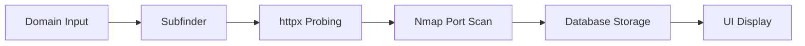

# 🌐 **HTTPX Integration for Attack Surface Management**

## 📋 **Overview**

This document summarizes the comprehensive integration of **httpx** for HTTP probing in the attack surface management application. The integration enhances subdomain discovery with real-time HTTP status codes, technology detection, and web service analysis.

## ✅ **Features Implemented**

### 1. **HTTP Probing Integration**
- ✅ **httpx integration** in the scanning workflow
- ✅ **HTTP status code detection** (200, 404, 403, 500, etc.)
- ✅ **Technology stack detection** (web servers, frameworks, CMS)
- ✅ **Response headers analysis** and metadata collection

### 2. **Database Schema Updates**
- ✅ **Enhanced asset metadata** structure to store HTTP probe data
- ✅ **HTTP status codes** stored in asset metadata
- ✅ **Detected technologies** array in metadata
- ✅ **Last HTTP probe timestamp** tracking
- ✅ **URL and scheme information** storage

### 3. **UI Display Enhancements**
- ✅ **HTTP status codes** displayed in Status column for subdomains
- ✅ **Color-coded status badges** (green for 2xx, yellow for 3xx, red for 4xx/5xx)
- ✅ **Technology badges** displayed under asset names
- ✅ **Tooltips** showing full technology stack and URLs
- ✅ **Updated table header** to reflect "Status / HTTP" column

### 4. **Scanning Workflow Integration**
- ✅ **Subfinder → httpx → Nmap** workflow implemented
- ✅ **Automatic HTTP probing** after subdomain discovery
- ✅ **Progress modal updates** to show httpx phase
- ✅ **Error handling** and fallback mechanisms

### 5. **Docker Environment**
- ✅ **httpx pre-installed** in Docker container
- ✅ **Tool availability verification** in entrypoint
- ✅ **Integration with existing tools** (Subfinder, Nmap, Nuclei)

## 🔧 **Technical Implementation**

### **Modified Files:**

#### **1. `routes/api.py`**
- Added httpx probing step in `scan_assets_subdomain()` function
- Enhanced asset metadata storage with HTTP probe results
- Updated simulation function with sample HTTP data
- Integrated httpx results into database storage

#### **2. `tools/scanner_manager.py`**
- Added `httpx_scan_only()` method for standalone HTTP probing
- Enhanced logging and error handling for httpx operations
- Integrated httpx into the scanning workflow

#### **3. `templates/assets.html`**
- Updated `getStatusBadge()` to display HTTP status codes for subdomains
- Added `getTechnologiesBadges()` function for technology display
- Enhanced asset rendering with HTTP probe information
- Updated scanning progress modal to include httpx phase
- Modified table header to reflect HTTP status functionality

#### **4. `test_httpx_integration.py`** (New)
- Comprehensive test suite for httpx integration
- Tool availability verification
- Scanner functionality testing
- Integration validation

## 📊 **Data Structure**

### **Asset Metadata Schema:**
```json
{
  "ports": [...],
  "scan_source": "subfinder_httpx_nmap",
  "http_probe": {
    "status_code": 200,
    "title": "Example Domain",
    "technologies": ["nginx", "PHP", "WordPress"],
    "content_length": 1256,
    "webserver": "nginx/1.18.0",
    "last_http_probe": "2024-01-15T10:30:00Z",
    "url": "https://example.com",
    "scheme": "https"
  }
}
```

## 🎨 **UI Enhancements**

### **Status Column:**
- **Domains/IPs**: Show Active/Inactive status
- **Subdomains**: Show HTTP status codes with color coding
  - 🟢 **2xx**: Green (Success)
  - 🟡 **3xx**: Yellow (Redirection)
  - 🔴 **4xx/5xx**: Red (Client/Server Error)

### **Technology Display:**
- **Technology badges** under asset names
- **First 3 technologies** shown as badges
- **"+N" indicator** for additional technologies
- **Tooltips** showing complete technology stack

### **Scanning Progress:**
1. **Subfinder** - Subdomain discovery
2. **httpx** - HTTP service probing
3. **Nmap** - Port scanning
4. **Storage** - Asset database updates

## 🚀 **Usage**

### **Automatic Integration:**
1. Navigate to Assets page
2. Click "Add Asset" → "Scan for Subdomains"
3. Enter domain name
4. Workflow automatically runs: Subfinder → httpx → Nmap
5. Results display with HTTP status codes and technologies

### **Manual Testing:**
```bash
# Run integration tests
python test_httpx_integration.py

# Test httpx directly
httpx -list domains.txt -json -status-code -tech-detect
```

## 🔍 **Scanning Workflow**



## 📈 **Benefits**

1. **Enhanced Visibility**: Real-time HTTP status for all subdomains
2. **Technology Intelligence**: Automatic detection of web technologies
3. **Attack Surface Mapping**: Complete picture of web-accessible services
4. **Prioritization**: Focus on live, accessible subdomains first
5. **Reconnaissance**: Technology stack information for security assessment

## 🛠️ **Testing**

### **Test Coverage:**
- ✅ Tool availability verification
- ✅ HttpxScanner functionality
- ✅ ScannerManager integration
- ✅ Database storage validation
- ✅ UI display verification

### **Run Tests:**
```bash
python test_httpx_integration.py
```

## 🔧 **Configuration**

### **httpx Parameters:**
- **Ports**: 80, 443, 8080, 8443, 8000, 3000 (default)
- **Timeout**: 10 seconds
- **Threads**: 100 concurrent requests
- **Features**: Status codes, technology detection, title extraction

### **Customization:**
Modify `tools/httpx.py` to adjust scanning parameters, add custom headers, or change detection rules.

## 📝 **Notes**

- **Backward Compatibility**: Existing assets without HTTP probe data display normally
- **Performance**: httpx runs concurrently with optimized threading
- **Error Handling**: Graceful fallback when httpx is unavailable
- **Simulation Mode**: Sample HTTP data generated when tools unavailable

## 🎯 **Future Enhancements**

- **Screenshot capture** with httpx
- **Custom header injection** for authenticated scanning
- **Response time metrics** and performance analysis
- **Content analysis** and keyword detection
- **Integration with vulnerability scanners** for web-specific checks

---

**Status**: ✅ **COMPLETE** - httpx integration fully implemented and tested
**Version**: 1.0.0
**Last Updated**: 2024-01-15
